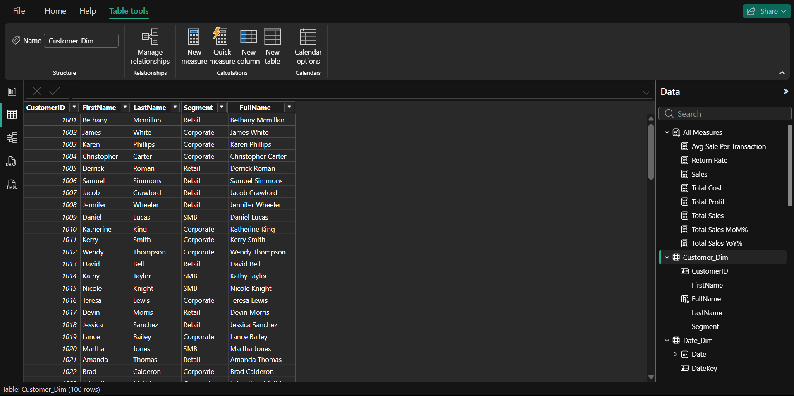
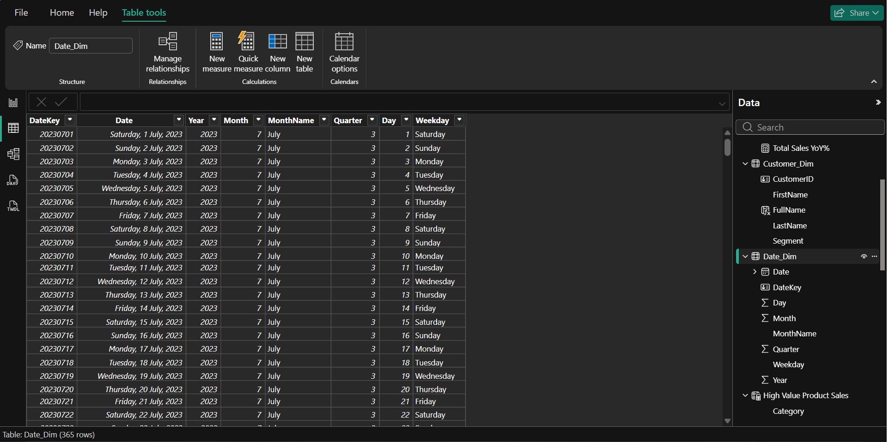
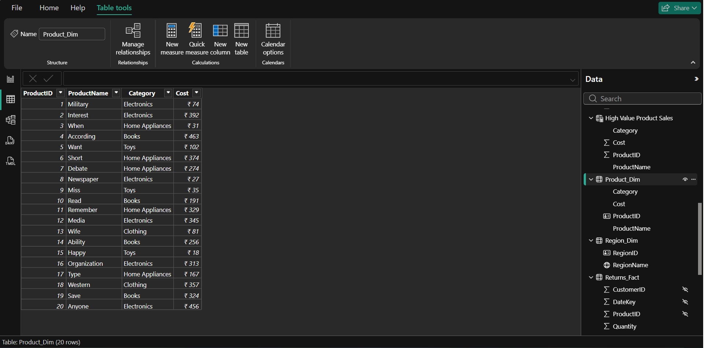
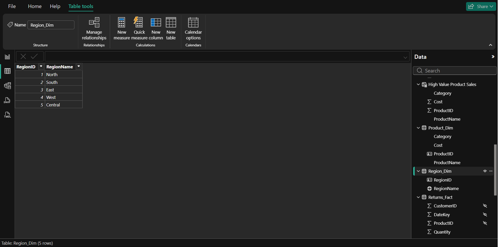
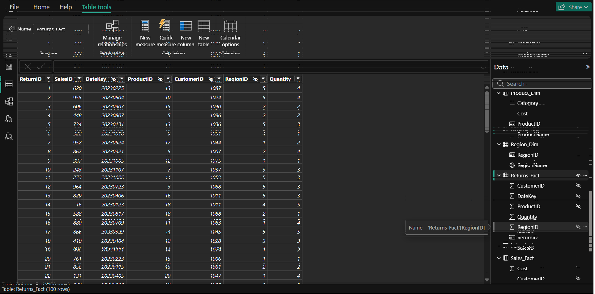
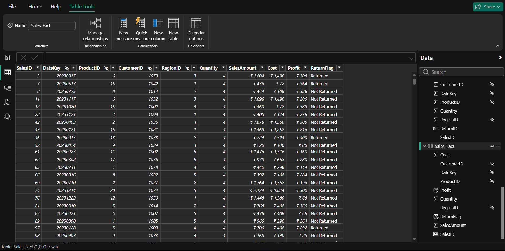
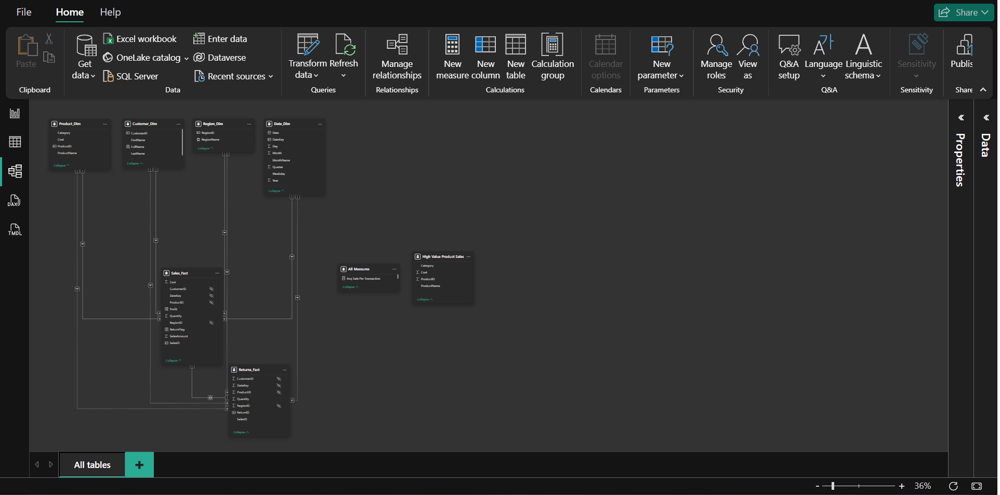
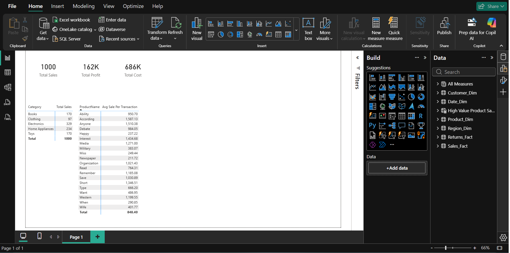

# DAX Depo — Power BI Advanced DAX Project 📊✨

## Project Overview

This repository contains the assets and project brief for **DAX Depo** — an advanced Power BI exercise focused on building a backend data model and implementing analytical calculations using DAX 🧮. The goal is to evaluate internal metrics, KPIs, and time-based insights using DAX formulas and Matrix visuals (Matrix visual is required for results) 📈.

📌 Original brief from Business Analyst Manager: build a model to calculate Sales, Costs, Returns, Profit, and Time Intelligence measures using only DAX functions. Deadline (original): 4 days after the submission 🗓️.

---

## 🔗 Quick Links

- 📁 Dataset folder: [`Data/`](Data/)
- 📄 Project brief: embedded in repository
- 📊 Recommended visual: Matrix (all results displayed in Matrix visual only)

---

## 📊 Required Dataset Tables (Provided)

The project expects these core tables (already attached in the brief):

- 💰 `Sales_Fact` — transactional sales table (SalesAmount, Quantity, etc.)
- 🔄 `Returns_Fact` — returns transactions linked to sales
- 👥 `Customer_Dim` — customer master (FirstName, LastName, CustomerKey, Segment)
- 🎁 `Product_Dim` — product master (ProductCategory, ProductName, etc.)
- 📅 `Date_Dim` — calendar/date table
- 🌍 `Region_Dim` — region / geography dimension

✅ **Ensure relationships are set** between fact tables and each dimension (📅 Date, 👥 Customer, 🎁 Product, 🌍 Region).

---

## 🧠 Tasks & Calculations (What to implement) 👇

👇 Follow the project brief and implement the following using DAX: (click to expand)

1. 📝 **Calculated Columns**
	- ➕ Add a `Profit` column in `Sales_Fact` as `SalesAmount - Cost`.
	- 🚩 Add a `ReturnFlag` column in `Sales_Fact` to show `Returned` or `Not Returned` (based on matching rows in `Returns_Fact`).
	- 🔤 Create a `FullName` column in `Customer_Dim` by concatenating `FirstName` and `LastName`.

2. 📊 **Measures** (required)
	- 💵 Total Sales
	- 📊 Total Cost
	- 💰 Total Profit
	- 📈 Return Rate (% of items returned)
	- 🔢 Average Sale per Transaction

3. ⚡ **Quick Measures** (use Power BI Quick Measures where appropriate)
	- 📈 Year-over-Year Sales Growth
	- 📊 Month-over-Month comparison (current vs previous month)

4. 📋 **Measure Management**
	- 📑 Create a dedicated measures table named `Measures` (recommended) to store all DAX measures.

5. 🎯 **Filter Context & Behavior**
	- 🔗 Use `ALL()`, `FILTER()`, `CALCULATE()` to manage filter context and build comparison measures and totals.

6. 🔧 **DAX Operators & Functions** (examples to use)
	- 📊 Aggregators: `SUM`, `AVERAGE`, `MAX`
	- 🔢 Counting: `COUNTROWS`, `DISTINCTCOUNT`
	- ⚙️ Logical: `IF`, `AND`, `OR`, `SWITCH`
	- 📝 Text: `CONCATENATE`, `UPPER`, `LEFT`
	- 📅 Date & Time: `YEAR`, `MONTH`, `DATESYTD`, `SAMEPERIODLASTYEAR`, `DATESINPERIOD`, `DATESBETWEEN`
	- 🔄 Iterator/Filter: `CALCULATE`, `FILTER`, `ALLSELECTED`

7. 🔗 **Joining & Relationships**
	- 🤝 Use `RELATED()` in calculated columns to pull dimension attributes into fact-level calculations when needed.

8. ⏰ **Time Intelligence** (matrix-based analysis)
	- 📅 Use `TOTALYTD`, `SAMEPERIODLASTYEAR`, `DATESINPERIOD` to analyze sales across months and years.
	- 📈 Build running totals with `CALCULATE()` + `DATESBETWEEN()` where necessary.

9. 🎨 **Additional Scenarios**
	- 🏷️ `SWITCH()` to categorize ranges (e.g., Low / Medium / High sales)
	- 🧠 Use `SUMX()` / `AVERAGEX()` for aggregations over filtered tables

---

## 📊 Output & Visualization Requirements 🎯

- ✅ All calculated results must be displayed in a **Matrix** visual only.
- 📋 Group Matrix by `Region`, `Month/Year`, `Product Category`, and `Customer Segment` as needed.
- 🚫 Do not use other visual types for final deliverable (charts may be used during exploration only).

---

## 📸 Screenshots

---

## 🎬 All-in-One Video Walkthrough

[DAX Depo - Power BI Advanced DAX Project Walkthrough](https://drive.google.com/file/d/1Z0Z0La6h_k53FRsTRYE4587ucEZQgEBf/view?usp=drive_link)

---

## 📦 Deliverables

- 📁 **Power BI Desktop file** (`.pbix`) containing:
  - 🔗 Clean data model with relationships
  - 🧠 Calculated columns and a `Measures` table with all DAX measures
  - 📊 Matrix visuals demonstrating required calculations and time intelligence
- 📖 **README** (this file) summarizing assumptions and steps to open/explore

---

## 🚀 How to Open & Review (Quick)

1. 📂 Open `Power BI Desktop`.
2. 📥 Load the dataset files from `Data/` into Power BI (if not already embedded in the `.pbix`).
3. 🔗 Confirm relationships in the Model view (📅 Date, 👥 Customer, 🎁 Product, 🌍 Region linked to fact tables).
4. 🎨 Use the Filters pane and Matrix visual to validate measure outputs by Region / Month / Product Category.

💡 **Pro tip:** Keep `Date_Dim` marked as a Date table and set `Date` column as the primary date for time intelligence.

---

## 📝 Notes & Assumptions 💡

- 🔧 The brief expects use of **DAX functions exclusively** for calculations.
- 📊 **Matrix visual is required** for final presentation — use row/column groups to emulate report layout.
- 📄 If you extend the model (e.g., add surrogate keys or additional dimensions), **document changes in this README**.

---

## 📬 Contact
- Author: Prath-Digital
- GitHub: [Prath-Digital](https://github.com/Prath-Digital)
- Email: [askforvarn@gmail.com](https://mail.google.com/mail/u/0/?fs=1&to=askforvarn@gmail.com&su=Topic&body=Hi+Prath%20Digital%0A%0AI+want+to+ask+about+...%0A%0AThanks,%0AYour+Name&tf=cm)

---

## 📜 License

This project is licensed under the MIT License - see the [LICENSE](LICENSE) file for details.

---

**Made with ❤️, DAX 🧮 and 🚀**

**BRING ON YOUR CODING ATTITUDE! ⚡️**
